# HomeEstate Realty — Data Flow Diagram (Mermaid)

> **Project:** Capstone Real Estate System — HomeEstate Realty  
> **Version:** 2.0 (Revised from source-code analysis)  
> **Date:** March 24, 2026  
> **Usage:** Copy any diagram's Mermaid code into draw.io (Extras → Edit Diagram → paste) or any Mermaid renderer.

---

## Table of Contents

1. [Context Diagram (Level 0)](#1-context-diagram-level-0)
2. [Level 1 DFD](#2-level-1-dfd)
3. [Level 2 DFD](#3-level-2-dfd)
   - [P1 — Authentication & Access Control](#p1--authentication--access-control)
   - [P2 — Agent Profile Management](#p2--agent-profile-management)
   - [P3 — Property Management](#p3--property-management)
   - [P4 — Sale Management](#p4--sale-management)
   - [P5 — Rental & Lease Management](#p5--rental--lease-management)
   - [P6 — Rental Payment Processing](#p6--rental-payment-processing)
   - [P7 — Commission Management](#p7--commission-management)
   - [P8 — Tour Request Management](#p8--tour-request-management)
   - [P9 — Notification Management](#p9--notification-management)
   - [P10 — Reports & Dashboard](#p10--reports--dashboard)
   - [P11 — System Settings Management](#p11--system-settings-management)
   - [P12 — Public Browsing](#p12--public-browsing)

---

## Node Format Reference

| Node Type | Mermaid Syntax | Shape |
|-----------|---------------|-------|
| External Entity | `E1["E1: Admin"]` | Rectangle |
| Data Store | `D1[("D1: Accounts")]` | Cylinder |
| Process | `P1(("P1\nAuth &\nAccess Control"))` | Double-circle |
| Sub-process | `P1_1(("P1.1\nCredential\nValidation"))` | Double-circle |
| Flow Label | `-->│"Noun phrase"│` | Arrow with label |

---

## External Entity Reference

| ID | Entity | Description |
|----|--------|-------------|
| E1 | Admin | System administrator managing all backend operations |
| E2 | Agent | Licensed real estate agent (registered user) |
| E3 | Public User / Client | Unauthenticated visitor browsing properties |
| E4 | Email Service (SMTP) | PHPMailer-based email delivery via SMTP |
| E5 | Cron Scheduler | Scheduled or admin-triggered lease expiry check |

## Data Store Reference

| ID | Data Store | Database Table |
|----|-----------|---------------|
| D1 | Accounts | `accounts` |
| D2 | User Roles | `user_roles` |
| D3 | 2FA Codes | `two_factor_codes` |
| D5 | Admin Logs | `admin_logs` |
| D6 | Agent Information | `agent_information` |
| D7 | Agent Specializations | `agent_specializations` |
| D8 | Specializations | `specializations` |
| D9 | Properties | `property` |
| D10 | Property Images | `property_images` |
| D11 | Floor Images | `property_floor_images` |
| D12 | Property Amenities | `property_amenities` |
| D13 | Amenities | `amenities` |
| D14 | Property Types | `property_types` |
| D15 | Rental Details | `rental_details` |
| D16 | Price History | `price_history` |
| D17 | Property Log | `property_log` |
| D18 | Status Log | `status_log` |
| D19 | Sale Verifications | `sale_verifications` |
| D20 | Sale Verification Docs | `sale_verification_documents` |
| D21 | Finalized Sales | `finalized_sales` |
| D22 | Agent Commissions | `agent_commissions` |
| D23 | Commission Payment Logs | `commission_payment_logs` |
| D24 | Rental Verifications | `rental_verifications` |
| D25 | Rental Verification Docs | `rental_verification_documents` |
| D26 | Finalized Rentals | `finalized_rentals` |
| D27 | Rental Payments | `rental_payments` |
| D28 | Rental Payment Docs | `rental_payment_documents` |
| D29 | Rental Commissions | `rental_commissions` |
| D30 | Tour Requests | `tour_requests` |
| D31 | Admin Notifications | `notifications` |
| D32 | Agent Notifications | `agent_notifications` |

---

## 1. Context Diagram (Level 0)

The Context Diagram shows the entire system as a single process (P0) and all external entity interactions.

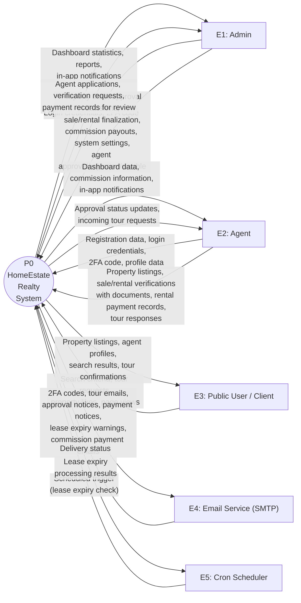

---

## 2. Level 1 DFD — By Module

The Level 1 DFD is presented **per module** below. Each diagram shows only the external entities and inter-process connections relevant to that module. Data stores are intentionally omitted at this level.

---

### Level 1 — P1: Authentication & Access Control

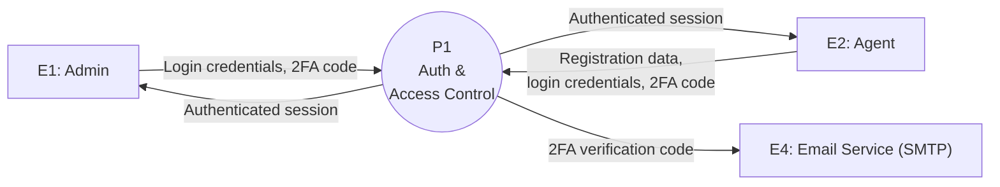

---

### Level 1 — P2: Agent Profile Management

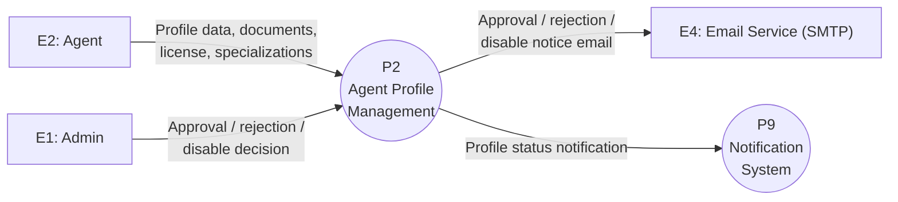

---

### Level 1 — P3: Property Management

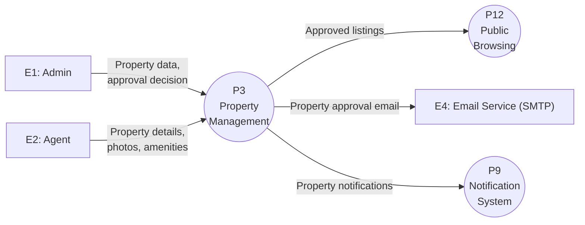

---

### Level 1 — P4: Sale Management

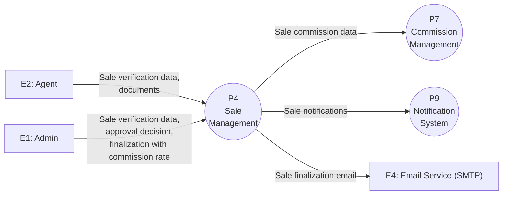

---

### Level 1 — P5: Rental & Lease Management

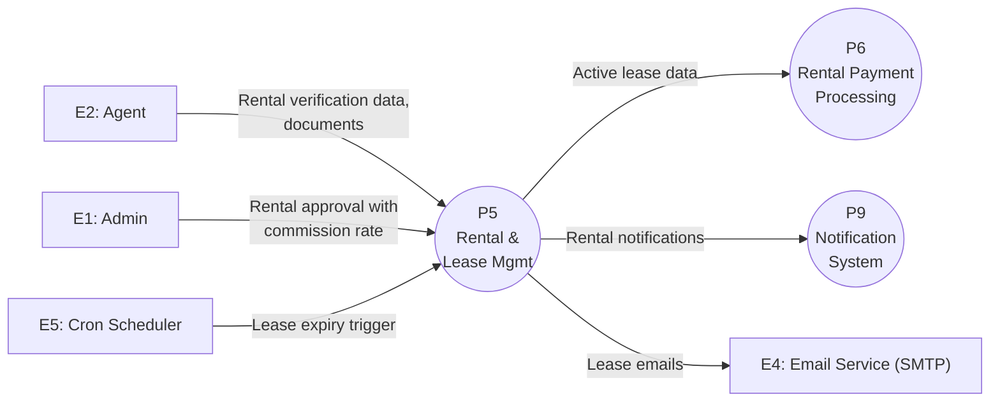

---

### Level 1 — P6: Rental Payment Processing

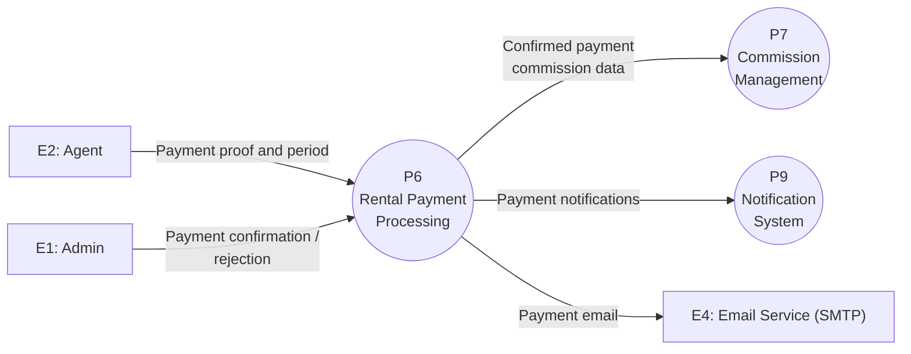

---

### Level 1 — P7: Commission Management

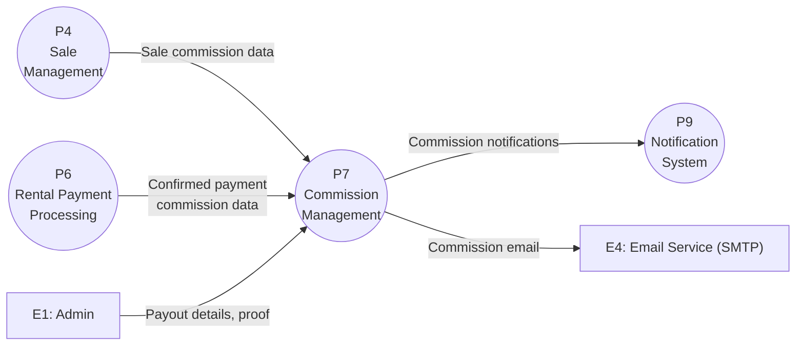

---

### Level 1 — P8: Tour Scheduling

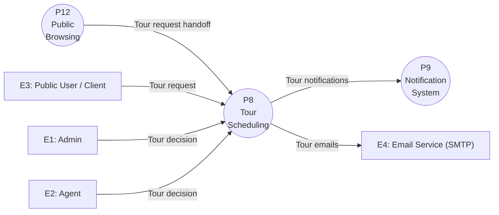

---

### Level 1 — P9: Notification System

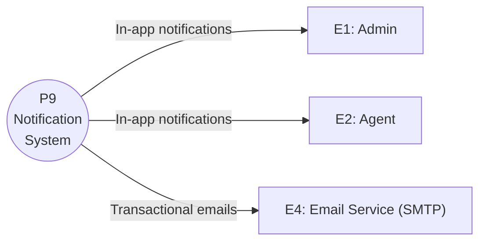

---

### Level 1 — P10: Reports & Dashboard

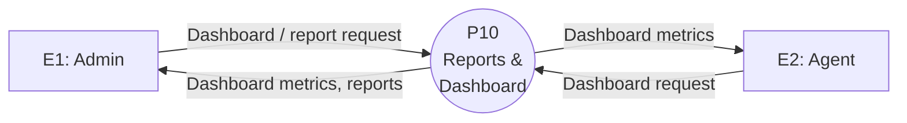

---

### Level 1 — P11: System Settings

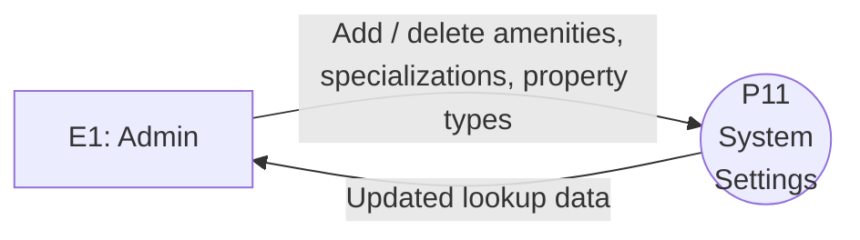

---

### Level 1 — P12: Public Browsing

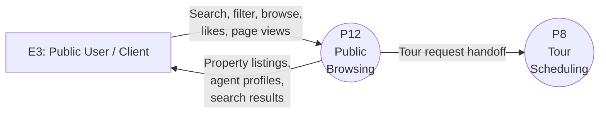

---

## 3. Level 2 DFD

The Level 2 diagrams below expand each Level 1 process and include data stores where the system reads or writes persistent records.

---

### P1 — Authentication & Access Control

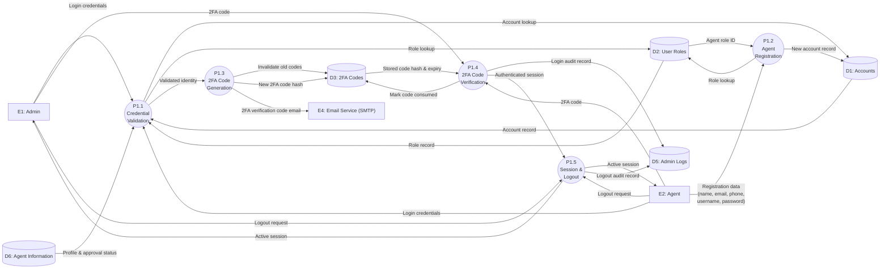

---

### P2 — Agent Profile Management

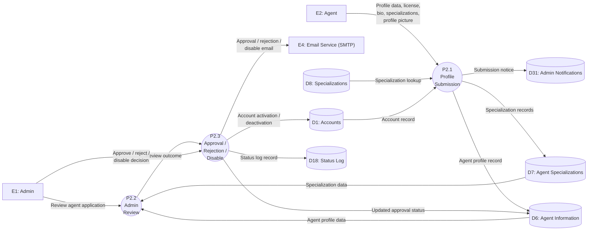

---

### P3 — Property Management

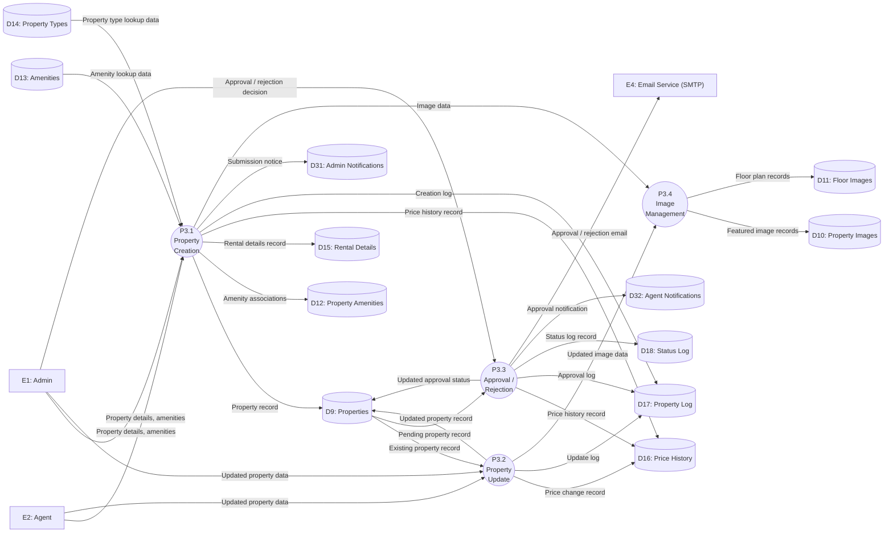

---

### P4 — Sale Management

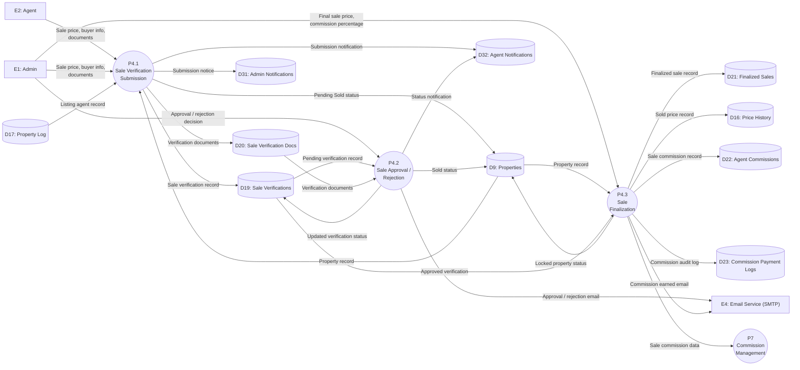

---

### P5 — Rental & Lease Management

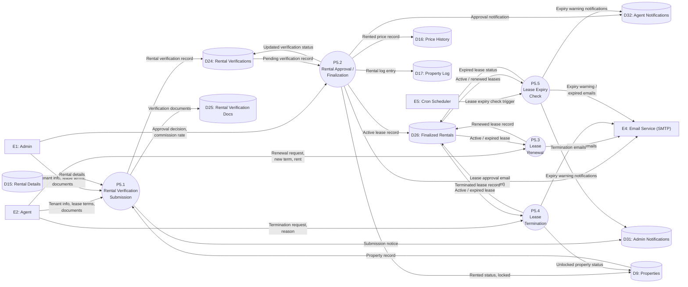

---

### P6 — Rental Payment Processing

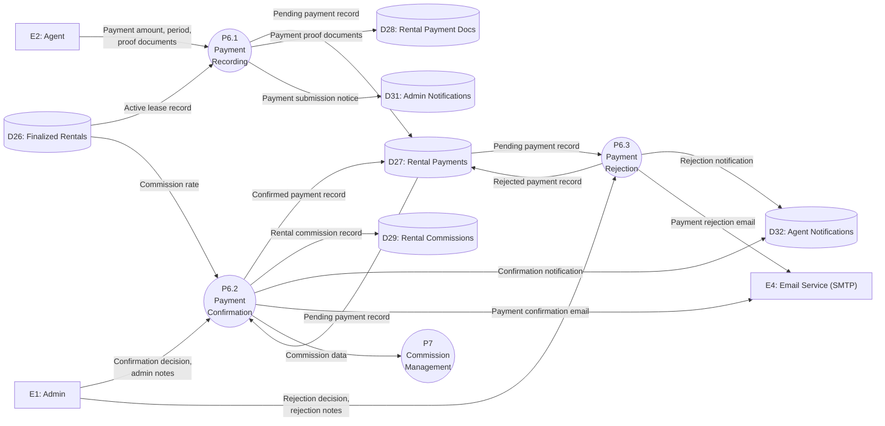

---

### P7 — Commission Management

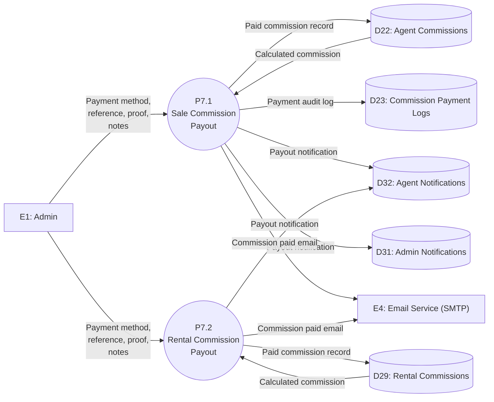

---

### P8 — Tour Request Management

```mermaid
flowchart LR
    E1["E1: Admin"]
    E2["E2: Agent"]
    E3["E3: Public User / Client"]
    E4["E4: Email Service (SMTP)"]
    D9[("D9: Properties")]
    D17[("D17: Property Log")]
    D30[("D30: Tour Requests")]
    D31[("D31: Admin Notifications")]
    D32[("D32: Agent Notifications")]

    P8_1(("P8.1\nTour Request\nSubmission"))
    P8_2(("P8.2\nTour\nConfirmation"))
    P8_3(("P8.3\nTour Rejection /\nCancellation"))
    P8_4(("P8.4\nTour Completion /\nExpiry"))

    E3 -->|"Name, contact,\ndate, time, tour type,\nmessage"| P8_1
    D9 -->|"Property record"| P8_1
    D17 -->|"Listing agent record"| P8_1
    P8_1 -->|"Pending tour request"| D30
    P8_1 -->|"New tour notification"| D32
    P8_1 -->|"New tour notification"| D31
    P8_1 -->|"Tour request email\n(agent + client)"| E4

    E1 -->|"Acceptance decision"| P8_2
    E2 -->|"Acceptance decision"| P8_2
    D30 -->|"Pending tour request"| P8_2
    P8_2 -->|"Confirmed tour record"| D30
    P8_2 -->|"Tour confirmation email"| E4

    E1 -->|"Rejection / cancellation"| P8_3
    E2 -->|"Rejection / cancellation"| P8_3
    D30 -->|"Tour request record"| P8_3
    P8_3 -->|"Rejected / cancelled record"| D30
    P8_3 -->|"Rejection / cancellation email"| E4

    E1 -->|"Completion decision"| P8_4
    E2 -->|"Completion decision"| P8_4
    D30 -->|"Tour records"| P8_4
    P8_4 -->|"Completed / expired record"| D30
    P8_4 -->|"Tour completion email"| E4
```

---

### P9 — Notification Management

```mermaid
flowchart LR
    E1["E1: Admin"]
    E2["E2: Agent"]
    E4["E4: Email Service (SMTP)"]
    D31[("D31: Admin Notifications")]
    D32[("D32: Agent Notifications")]

    P9_1(("P9.1\nAdmin Notification\nManagement"))
    P9_2(("P9.2\nAgent Notification\nManagement"))
    P9_3(("P9.3\nEmail\nDispatch"))

    D31 -->|"Unread notifications"| P9_1
    P9_1 -->|"In-app notifications"| E1
    E1 -->|"Read / delete request"| P9_1
    P9_1 -->|"Updated notification records"| D31

    D32 -->|"Unread notifications"| P9_2
    P9_2 -->|"In-app notifications"| E2
    E2 -->|"Read / delete request"| P9_2
    P9_2 -->|"Updated notification records"| D32

    P9_3 -->|"Transactional emails"| E4
```

---

### P10 — Reports & Dashboard

```mermaid
flowchart LR
    E1["E1: Admin"]
    E2["E2: Agent"]
    D1[("D1: Accounts")]
    D5[("D5: Admin Logs")]
    D6[("D6: Agent Information")]
    D9[("D9: Properties")]
    D17[("D17: Property Log")]
    D18[("D18: Status Log")]
    D21[("D21: Finalized Sales")]
    D22[("D22: Agent Commissions")]
    D26[("D26: Finalized Rentals")]
    D27[("D27: Rental Payments")]
    D29[("D29: Rental Commissions")]
    D30[("D30: Tour Requests")]

    P10_1(("P10.1\nDashboard\nStatistics"))
    P10_2(("P10.2\nProperty\nReports"))
    P10_3(("P10.3\nSales & Rental\nReports"))
    P10_4(("P10.4\nAgent\nReports"))
    P10_5(("P10.5\nActivity\nLogs"))

    D1 -->|"Account records"| P10_1
    D9 -->|"Property records"| P10_1
    D21 -->|"Sales records"| P10_1
    D26 -->|"Rental records"| P10_1
    D30 -->|"Tour records"| P10_1
    P10_1 -->|"Dashboard statistics"| E1
    P10_1 -->|"Dashboard statistics"| E2

    D9 -->|"Property records"| P10_2
    P10_2 -->|"Property reports"| E1

    D21 -->|"Sale records"| P10_3
    D22 -->|"Sale commission records"| P10_3
    D26 -->|"Rental records"| P10_3
    D27 -->|"Payment records"| P10_3
    D29 -->|"Rental commission records"| P10_3
    P10_3 -->|"Sales and rental reports"| E1

    D6 -->|"Agent profile records"| P10_4
    D21 -->|"Agent sale records"| P10_4
    D26 -->|"Agent rental records"| P10_4
    P10_4 -->|"Agent performance reports"| E1

    D5 -->|"Admin log records"| P10_5
    D17 -->|"Property log records"| P10_5
    D18 -->|"Status log records"| P10_5
    P10_5 -->|"Activity log reports"| E1
```

---

### P11 — System Settings Management

```mermaid
flowchart LR
    E1["E1: Admin"]
    D8[("D8: Specializations")]
    D13[("D13: Amenities")]
    D14[("D14: Property Types")]

    P11_1(("P11.1\nAmenity\nManagement"))
    P11_2(("P11.2\nSpecialization\nManagement"))
    P11_3(("P11.3\nProperty Type\nManagement"))

    E1 -->|"Add / delete amenity"| P11_1
    D13 -->|"Existing amenity records"| P11_1
    P11_1 -->|"Updated amenity records"| D13

    E1 -->|"Add / delete specialization"| P11_2
    D8 -->|"Existing specialization records"| P11_2
    P11_2 -->|"Updated specialization records"| D8

    E1 -->|"Add / delete property type"| P11_3
    D14 -->|"Existing property type records"| P11_3
    P11_3 -->|"Updated property type records"| D14
```

---

### P12 — Public Browsing

```mermaid
flowchart LR
    E3["E3: Public User / Client"]
    D6[("D6: Agent Information")]
    D9[("D9: Properties")]
    D10[("D10: Property Images")]
    D11[("D11: Floor Images")]
    D12[("D12: Property Amenities")]
    D15[("D15: Rental Details")]

    P12_1(("P12.1\nProperty Search\n& Filter"))
    P12_2(("P12.2\nProperty Detail\nView"))
    P12_3(("P12.3\nAgent Profile\nView"))
    P12_4(("P12.4\nProperty\nInteraction"))

    E3 -->|"Search criteria,\nfilter parameters"| P12_1
    D9 -->|"Approved property records"| P12_1
    D10 -->|"Property image records"| P12_1
    P12_1 -->|"Search results,\nlisting data"| E3

    E3 -->|"Property page request"| P12_2
    D9 -->|"Property record"| P12_2
    D10 -->|"Featured image records"| P12_2
    D11 -->|"Floor plan records"| P12_2
    D12 -->|"Amenity records"| P12_2
    D15 -->|"Rental details"| P12_2
    D6 -->|"Agent profile record"| P12_2
    P12_2 -->|"Full property details"| E3

    E3 -->|"Agent profile request"| P12_3
    D6 -->|"Agent profile record"| P12_3
    D9 -->|"Agent property listings"| P12_3
    P12_3 -->|"Agent profile data,\nlistings"| E3

    E3 -->|"Property like,\npage view"| P12_4
    D9 -->|"Property record"| P12_4
    P12_4 -->|"Updated view count,\nlike count"| D9
```
