# Real Estate Management System — DFD Mermaid Diagrams

> **Project:** Capstone Real Estate System  
> **Version:** 1.0  
> **Date:** March 10, 2026  
> **Usage:** Copy any diagram's Mermaid code into draw.io (Extras → Edit Diagram → paste) or any Mermaid renderer.

---

## Table of Contents

1. [Context Diagram](#1-context-diagram)
2. [Level 0 DFD](#2-level-0-dfd)
3. [Level 1 DFD](#3-level-1-dfd)
   - [P1 — Authentication & Access Control](#p1--authentication--access-control)
   - [P2 — Agent Profile Management](#p2--agent-profile-management)
   - [P3 — Property Management](#p3--property-management)
   - [P4 — Sale Management](#p4--sale-management)
   - [P5 — Rental & Lease Management](#p5--rental--lease-management)
   - [P6 — Rental Payment Processing](#p6--rental-payment-processing)
   - [P7 — Commission Management](#p7--commission-management)
   - [P8 — Tour Request Management](#p8--tour-request-management)
   - [P9 — Notification Management](#p9--notification-management)
   - [P10 — Reports & Dashboard](#p10--reports--dashboard)
   - [P11 — System Settings Management](#p11--system-settings-management)
   - [P12 — Public Browsing](#p12--public-browsing)

---

## Node Format Reference

| Node Type | Mermaid Syntax | Shape |
|-----------|---------------|-------|
| External Entity | `E1["E1: Admin"]` | Rectangle |
| Data Store | `D1[("D1: Accounts")]` | Cylinder |
| Process | `P1(("P1\nAuth &\nAccess Control"))` | Double-circle |
| Sub-process | `P1_1(("P1.1\nCredential\nValidation"))` | Double-circle |
| Flow Label | `-->│"Noun phrase"│` | Arrow with label |

---

## 1. Context Diagram

The Context Diagram shows the entire system as a single process (P0) and all external entity interactions.

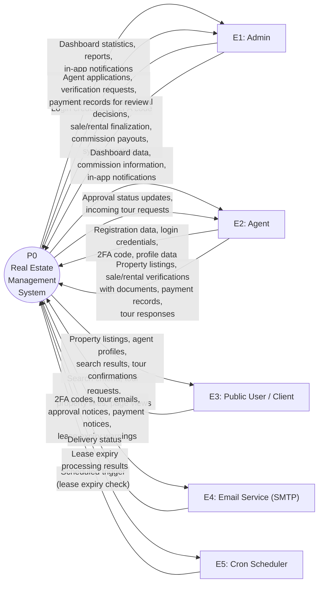

---

## 2. Level 0 DFD

The Level 0 DFD decomposes the system into 12 major processes (P1–P12), their interactions with external entities and data stores.

```mermaid
flowchart TB
    %% External Entities
    E1["E1: Admin"]
    E2["E2: Agent"]
    E3["E3: Public User / Client"]
    E4["E4: Email Service (SMTP)"]
    E5["E5: Cron Scheduler"]

    %% Processes
    P1(("P1\nAuth &\nAccess Control"))
    P2(("P2\nAgent Profile\nManagement"))
    P3(("P3\nProperty\nManagement"))
    P4(("P4\nSale\nManagement"))
    P5(("P5\nRental &\nLease Mgmt"))
    P6(("P6\nPayment\nProcessing"))
    P7(("P7\nCommission\nManagement"))
    P8(("P8\nTour\nScheduling"))
    P9(("P9\nNotification\nSystem"))
    P10(("P10\nReports &\nDashboard"))
    P11(("P11\nSystem\nSettings"))
    P12(("P12\nPublic\nBrowsing"))

    %% Data Stores
    D1[("D1: Accounts")]
    D3[("D3: 2FA Codes")]
    D5[("D5: Admin Logs")]
    D6[("D6: Agent Information")]
    D9[("D9: Properties")]
    D19[("D19: Sale Verifications")]
    D21[("D21: Finalized Sales")]
    D22[("D22: Agent Commissions")]
    D24[("D24: Rental Verifications")]
    D26[("D26: Finalized Rentals")]
    D27[("D27: Rental Payments")]
    D29[("D29: Rental Commissions")]
    D30[("D30: Tour Requests")]
    D31[("D31: Admin Notifications")]
    D32[("D32: Agent Notifications")]

    %% P1 Authentication & Access Control
    E1 -->|"Login credentials, 2FA code"| P1
    E2 -->|"Registration data, login credentials, 2FA code"| P1
    P1 -->|"2FA verification code"| E4
    P1 <-->|"Account records"| D1
    P1 <-->|"2FA code records"| D3
    P1 -->|"Login/logout audit records"| D5

    %% P2 Agent Profile Management
    E2 -->|"Profile data, license, specializations"| P2
    E1 -->|"Approval decision"| P2
    P2 -->|"Approval notice email"| E4
    P2 <-->|"Agent profile records"| D6
    P2 -->|"Profile submission notice"| D31

    %% P3 Property Management
    E1 -->|"Property details, images, amenities"| P3
    E2 -->|"Property details, images, amenities"| P3
    P3 -->|"Approval email"| E4
    P3 <-->|"Property records"| D9
    P3 -->|"Submission notice"| D31
    P3 -->|"Approval notification"| D32

    %% P4 Sale Management
    E2 -->|"Sale price, buyer info, documents"| P4
    E1 -->|"Sale approval decision"| P4
    P4 -->|"Sale approval email"| E4
    P4 <-->|"Sale verification records"| D19
    P4 -->|"Finalized sale record"| D21
    P4 <-->|"Property status update"| D9
    P4 -->|"Sale commission data"| P7
    P4 -->|"Submission notice"| D31
    P4 -->|"Sale approval notification"| D32

    %% P5 Rental & Lease Management
    E2 -->|"Tenant info, lease terms, documents"| P5
    E1 -->|"Rental approval decision, commission rate"| P5
    E5 -->|"Lease expiry check signal"| P5
    P5 -->|"Lease emails"| E4
    P5 <-->|"Rental verification records"| D24
    P5 <-->|"Active lease records"| D26
    P5 <-->|"Property status update"| D9
    P5 -->|"Submission notice"| D31
    P5 -->|"Rental approval notification"| D32

    %% P6 Payment Processing
    E2 -->|"Payment amount, period, proof documents"| P6
    E1 -->|"Confirmation or rejection decision"| P6
    P6 -->|"Payment status email"| E4
    P6 <-->|"Payment records"| D27
    P6 -->|"Rental commission data"| P7
    P6 -->|"Payment submission notice"| D31
    P6 -->|"Payment notification"| D32

    %% P7 Commission Management
    E1 -->|"Payout details, proof documents"| P7
    P7 -->|"Commission payment email"| E4
    P7 <-->|"Sale commission records"| D22
    P7 <-->|"Rental commission records"| D29
    P7 -->|"Commission payment notification"| D32

    %% P8 Tour Scheduling
    E3 -->|"Client name, contact, preferred date, tour type"| P8
    E1 -->|"Tour accept/reject/complete decision"| P8
    E2 -->|"Tour accept/reject/complete decision"| P8
    P8 -->|"Tour status email"| E4
    P8 <-->|"Tour request records"| D30
    P8 -->|"New tour notification"| D31
    P8 -->|"New tour notification"| D32

    %% P9 Notification System
    P9 -->|"In-app notifications"| E1
    P9 -->|"In-app notifications"| E2
    P9 -->|"Transactional emails"| E4
    P9 <-->|"Admin notification records"| D31
    P9 <-->|"Agent notification records"| D32

    %% P10 Reports & Dashboard
    P10 -->|"Dashboard statistics, reports"| E1
    P10 -->|"Dashboard statistics"| E2
    D1 -->|"Account records"| P10
    D9 -->|"Property records"| P10
    D21 -->|"Sales records"| P10
    D26 -->|"Rental records"| P10
    D30 -->|"Tour records"| P10
    D5 -->|"Admin log records"| P10
    D22 -->|"Commission records"| P10
    D27 -->|"Payment records"| P10
    D29 -->|"Rental commission records"| P10

    %% P11 System Settings
    E1 -->|"Amenity, specialization, property type data"| P11

    %% P12 Public Browsing
    E3 -->|"Search criteria, property likes, page views"| P12
    P12 -->|"Property listings, agent profiles, search results"| E3
    D9 -->|"Approved property records"| P12
    D6 -->|"Agent profile records"| P12
```

---

## 3. Level 1 DFD

Each major process (P1–P12) is decomposed into its sub-processes below.

---

### P1 — Authentication & Access Control

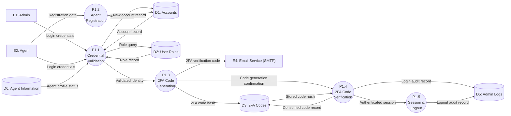

---

### P2 — Agent Profile Management

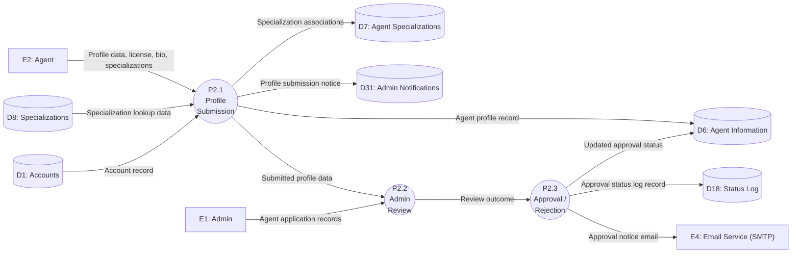

---

### P3 — Property Management

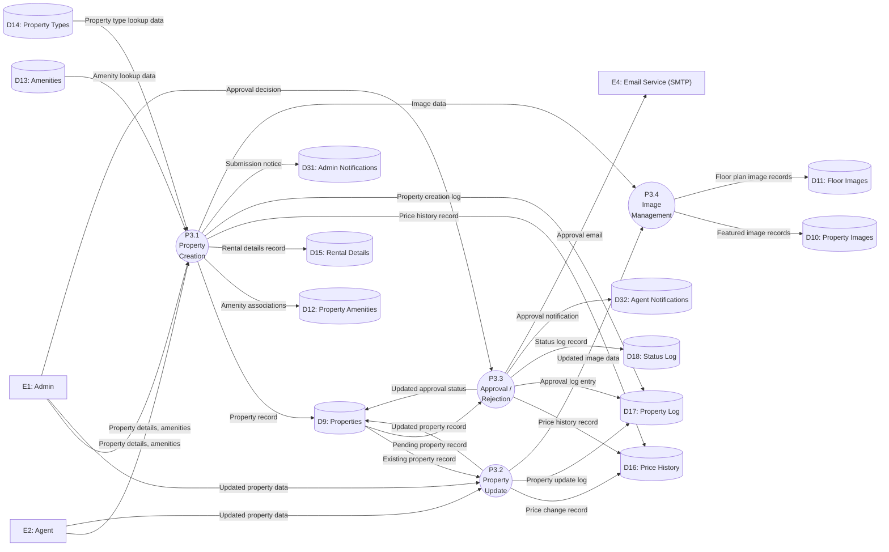

---

### P4 — Sale Management

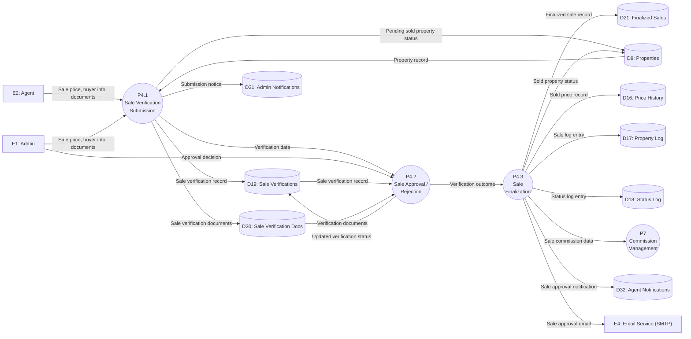

---

### P5 — Rental & Lease Management

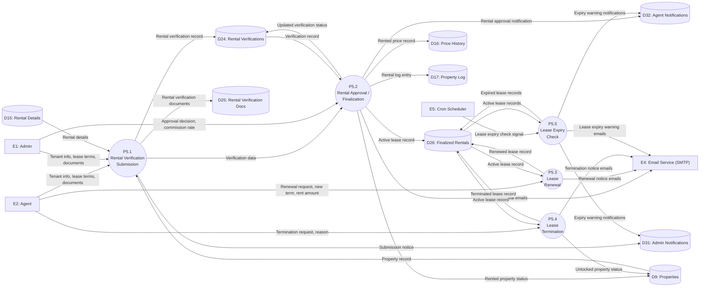

---

### P6 — Rental Payment Processing

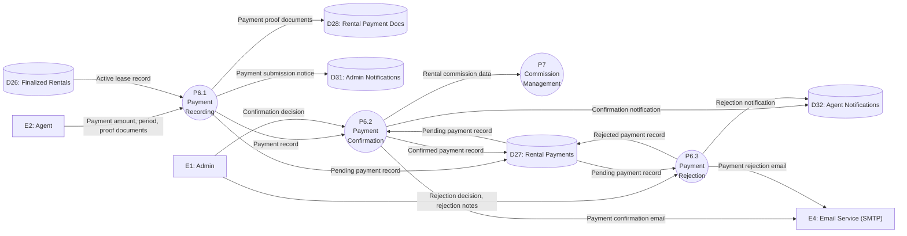

---

### P7 — Commission Management

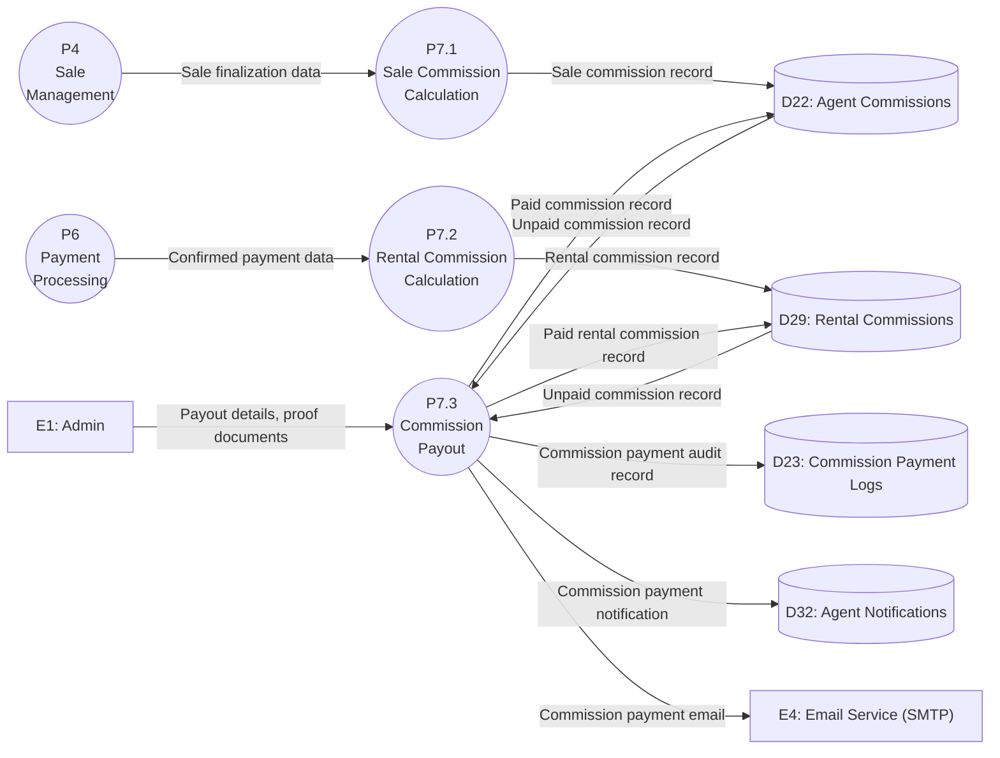

---

### P8 — Tour Request Management

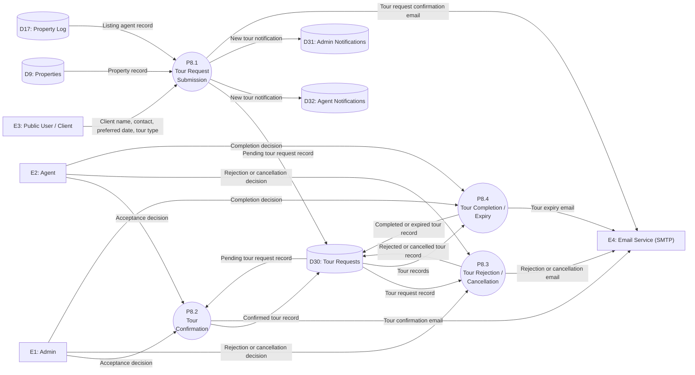

---

### P9 — Notification Management

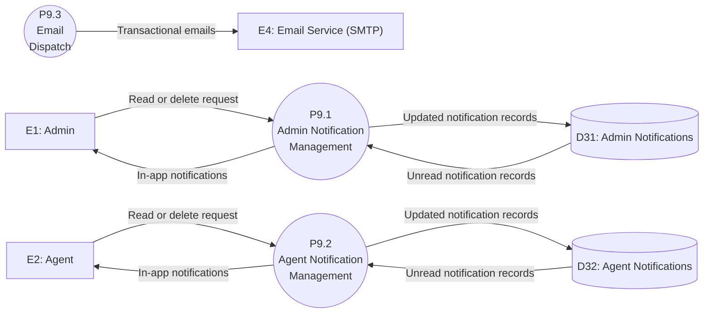

---

### P10 — Reports & Dashboard

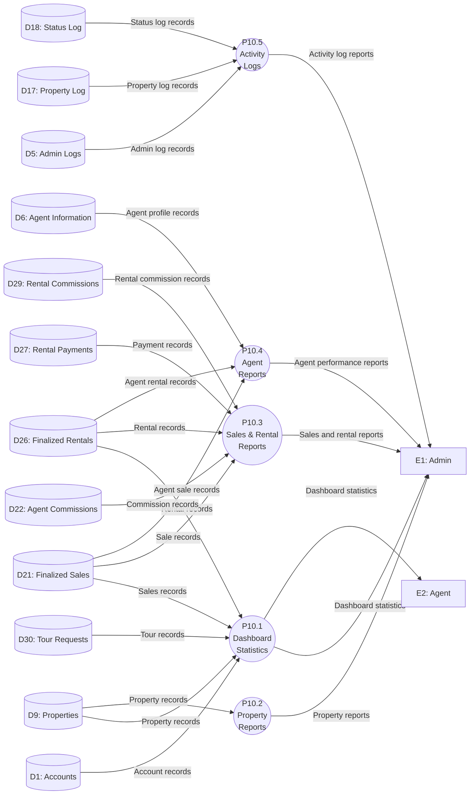

---

### P11 — System Settings Management

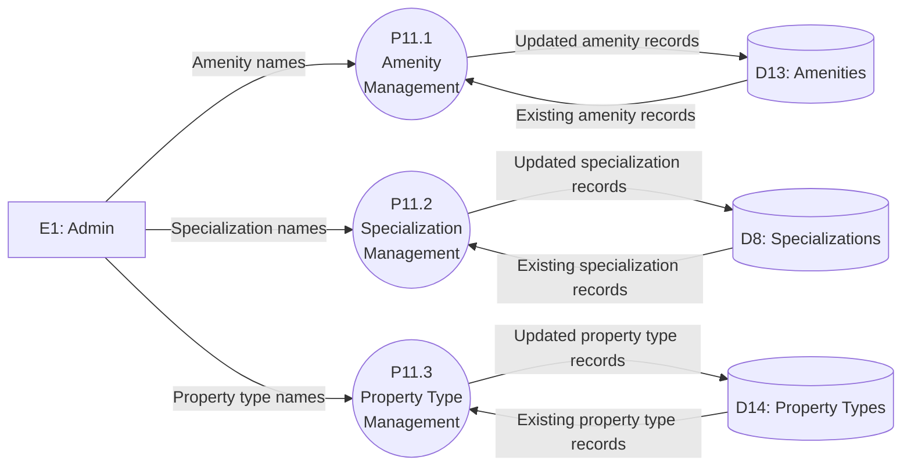

---

### P12 — Public Browsing

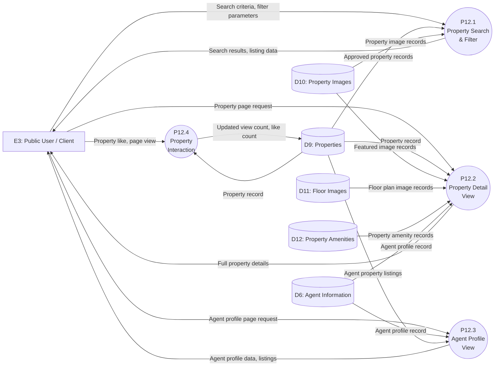
