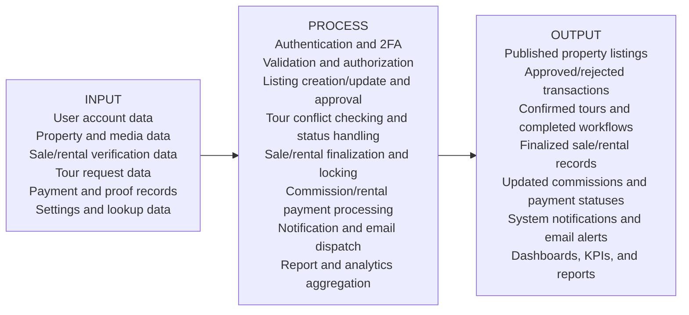

# HomeEstate Realty Conceptual Framework (IPO Model)

Version: 1.0  
Date: 2026-03-16  
System: HomeEstate Realty (PHP-MySQL Multi-Portal Platform)

## 1. Framework Overview

This conceptual framework presents the HomeEstate Realty system using the Input-Process-Output (IPO) Model.  
It is based on the actual implemented modules, workflows, and database structures of the system, including:

- Authentication and 2FA security flow
- Admin, Agent, and Public user operations
- Property listing and approval pipelines
- Sale and rental verification/finalization workflows
- Tour scheduling and conflict handling
- Commission and rental payment processing
- Notifications, email alerts, and reports

The framework explains how raw user-entered and system-generated data (Input) are transformed by business and transaction workflows (Process) into operational results, decisions, records, and analytics (Output).

---

## 2. IPO Conceptual Model Diagram

---

## 3. Input Component

The Input component consists of all data captured from users, admins, agents, uploaded files, and derived transaction values.

## 3.1 User and account inputs

- Login credentials: username and password
- 2FA verification code (email OTP)
- Registration data: first name, middle name, last name, username, email, normalized PH mobile number, password
- Role and profile completion data for admin and agent accounts

Primary tables affected:

- `accounts`
- `user_roles`
- `two_factor_codes`
- `admin_information`
- `agent_information`
- `agent_specializations`

## 3.2 Property listing inputs

- Location and property identity: street, city, barangay, province, ZIP
- Listing profile: property type, listing type (For Sale/For Rent), status, source, MLS number
- Price and unit details: listing price, lot size, square footage, bedrooms, bathrooms, parking, year built
- Description and publication date
- Amenities (multi-select)
- Featured property images and floor images

Primary tables affected:

- `property`
- `property_types`
- `amenities`
- `property_amenities`
- `property_images`
- `property_floor_images`
- `property_log`
- `status_log`

## 3.3 Rental and sale transaction inputs

- Sale verification data: sale price, sale date, buyer details, supporting notes, sale documents
- Rental verification data: tenant details, monthly rent, security deposit, lease term, lease dates, supporting notes, rental documents
- Finalization fields from admin: final sale details, commission rates, admin notes

Primary tables affected:

- `sale_verifications`
- `sale_verification_documents`
- `finalized_sales`
- `rental_verifications`
- `rental_verification_documents`
- `finalized_rentals`

## 3.4 Tour workflow inputs

- Public tour request fields: name, email, phone, tour date, time, tour type (public/private), message
- Admin/agent decision actions: accept, reject, cancel, complete

Primary tables affected:

- `tour_requests`
- `notifications`
- `agent_notifications`

## 3.5 Payment and commission inputs

- Commission processing fields: commission id, payment method, payment reference, payment notes, payment proof upload
- Rental payment fields: rental id, amount, payment date, period start/end, notes, payment evidence files
- Admin confirmation/rejection remarks for payments

Primary tables affected:

- `agent_commissions`
- `commission_payment_logs`
- `rental_payments`
- `rental_payment_documents`
- `rental_commissions`

## 3.6 Administrative and configuration inputs

- Settings management entries: amenities, specializations, and property types
- Notification actions: read/unread, bulk updates, cleanup actions
- Session activity and timeout-related state

Primary tables affected:

- `amenities`
- `specializations`
- `property_types`
- `notifications`
- `agent_notifications`
- `admin_logs`

---

## 4. Process Component

The Process component transforms all system inputs into validated, role-governed, and transaction-safe operations.

## 4.1 Security, authentication, and access control process

- Session cookie hardening and strict session handling
- Credential verification through account-role join
- Agent pre-login checks (profile completion and approval)
- OTP generation, throttling, rate limiting, hashing, and expiration checks
- OTP verification and session fixation prevention (`session_regenerate_id(true)`)
- Role-based routing and guarded page access (admin/agent/public)
- Inactivity timeout control with background-poll exception logic

## 4.2 Data validation and normalization process

- Strong server-side validation for required fields, datatypes, ranges, and enum domains
- Date and period logic checks (e.g., lease periods, payment periods, listing dates)
- ZIP, email, phone, and numeric validation rules
- Referential validation (e.g., property types, amenities)
- File validation through MIME detection, extension checks, size thresholds, and required document rules

## 4.3 Property listing and lifecycle process

- Transactional insert/update of property master record and related entities
- Role-aware approval assignment:
  - admin-created listings: directly approved
  - agent-created listings: pending approval
- Storage and ordering of featured and floor images
- Logging and history tracking (`property_log`, `status_log`, `price_history`)
- Property state transitions (For Sale/For Rent -> Sold/Rented with lock controls)

## 4.4 Tour request processing process

- Tour request capture from public interface and linkage to responsible account
- Conflict detection using exact-time and 30-minute proximity logic
- Public/private grouping rules for overlapping schedules
- Controlled status transitions (Pending -> Confirmed/Rejected/Cancelled -> Completed)
- Notification and email dispatch to involved users

## 4.5 Sale transaction process

- Submission and review of sale verification records and documents
- Admin approval/rejection pipeline
- Sale finalization with transaction-safe upsert logic
- Commission calculation and lifecycle transition to calculated status
- Commission payment processing with row locking, proof storage, and audit logging

## 4.6 Rental transaction and lease process

- Rental verification submission and admin review
- Lease finalization and property locking for rented properties
- Monthly rental payment submission by agent with overlap protection
- Admin payment confirmation/rejection and rental commission generation
- Lease renewal handling with date recomputation and pending-payment constraints
- Scheduled lease reminder and auto-expiry process via cron

## 4.7 Communication and monitoring process

- Internal notifications for admin and agent events
- System email generation using reusable templates and SMTP transport
- Financial, activity, and operational reporting aggregation
- Dashboard KPI generation (properties, tours, sales, rental revenue, commissions)

---

## 5. Output Component

The Output component represents all resulting states, records, decisions, and user-visible system responses.

## 5.1 User-facing outputs

- Published and searchable property listings for public users
- Property detail pages with images, amenities, and rental/sale metadata
- Tour request submission confirmations and status updates
- Like counts and view count updates on properties

## 5.2 Admin and agent operational outputs

- Approved/rejected property, sale, and rental verification decisions
- Confirmed/rejected/cancelled/completed tour records
- Finalized sales and finalized rental leases
- Lease lifecycle updates (renewed, expired, terminated)
- Processed commission statuses (calculated, processing, paid)
- Confirmed/rejected rental payment records with evidence linkage

## 5.3 Data and audit outputs

- Updated master and transactional records across all core tables
- Property, status, and commission audit logs
- Notification entries for admin and agent users
- Timestamped and traceable payment/verification actions

## 5.4 Communication outputs

- 2FA OTP emails
- Tour request and confirmation emails
- Sale/rental approval and rejection emails
- Commission earned and paid emails
- Lease expiry and lease renewal emails

## 5.5 Management and analytics outputs

- Admin dashboard summaries and trend charts
- Reports for properties, sales, rentals, tours, agents, and activity logs
- KPI metrics for operational and financial monitoring

---

## 6. IPO Matrix (Capstone-Ready Summary)

| Input | Process | Output |
|---|---|---|
| User account credentials, registration profile data, OTP codes | Authentication, role checks, 2FA validation, session security | Authenticated sessions, role-based redirects, login activity logs |
| Property listing details, amenities, and uploaded images | Validation, file checks, transactional create/update, approval routing | Published/pending/rejected listings, updated media records, property logs |
| Tour request details and schedule choices | Conflict detection, status transition logic, notification/email dispatch | Confirmed/rejected/cancelled/completed tours, communication alerts |
| Sale verification data and supporting documents | Approval review, finalization transaction, commission calculation | Finalized sales, calculated commissions, approval/rejection outputs |
| Rental verification, lease terms, and supporting documents | Approval review, lease finalization, property lock and lease state management | Finalized rentals, rented property status, lease records and logs |
| Rental payment details and proof files | Ownership checks, overlap validation, admin confirmation/rejection, commission generation | Confirmed/rejected payments, rental commissions, updated payment records |
| Commission payout metadata and proof | Double-payment protection, proof storage, audit logging, notification/email | Paid commission records, payment logs, agent payout notifications |
| Settings and taxonomy entries (amenities/types/specializations) | CRUD with duplicate and dependency validation | Updated reference data for system-wide forms and filters |
| Operational data across modules | Aggregation and analytics queries | Reports, KPIs, dashboards, and management insights |

---

## 7. Narrative Statement for Capstone Paper

The HomeEstate Realty system follows an Input-Process-Output framework in which multi-source transactional inputs from public users, agents, and administrators are validated and transformed through secured, role-based, and database-transaction-driven processes. These processes produce structured outputs including published listings, approval decisions, finalized sale and rental records, commission and payment outcomes, automated communications, and analytic reports. As implemented, the IPO chain supports operational control, financial traceability, and decision support for end-to-end real estate management.

---

## 8. Scope Notes

This IPO conceptual framework reflects the currently implemented production logic of the HomeEstate Realty codebase and schema, particularly the real behavior of:

- authentication/2FA flow
- listing approval workflows
- tour conflict handling
- sale and rental finalization pipelines
- commission and rental payment processing
- reporting and notification subsystems

It is therefore suitable as a system-aligned conceptual framework for capstone documentation.
